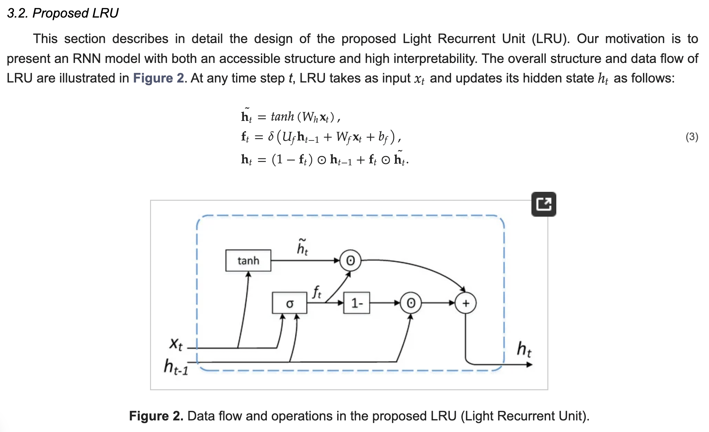

</img>

## Light Recurrent Unit - Pytorch

Implementation of the <a href="https://www.mdpi.com/2079-9292/13/16/3204">Light Recurrent Unit</a> in Pytorch

## Install

```bash
$ pip install light-recurrent-unit-pytorch
```

## Usage

```python
import torch
from light_recurrent_unit_pytorch import LightRecurrentUnitCell

cell = LightRecurrentUnitCell(256)

x = torch.randn(2, 256)
hidden = torch.randn(2, 256)

next_hidden = cell(x, hidden) # (2, 256)
```

Single layer

```python
import torch
from light_recurrent_unit_pytorch import LightRecurrentUnitLayer

layer = LightRecurrentUnitLayer(256)

x = torch.randn(2, 1024, 256)

out = layer(x) # (2, 1024, 256)

assert out.shape == x.shape
```

Stacked

```python
import torch
from light_recurrent_unit_pytorch import LightRecurrentUnit

lru = LightRecurrentUnit(256, depth = 4)

x = torch.randn(2, 1024, 256)

out, layer_hiddens = lru(x) # (2, 1024, 256), List[(2, 256)]

assert out.shape == x.shape
```

## Citations

```bibtex
@Article{electronics13163204,
    AUTHOR = {Ye, Hong and Zhang, Yibing and Liu, Huizhou and Li, Xuannong and Chang, Jiaming and Zheng, Hui},
    TITLE = {Light Recurrent Unit: Towards an Interpretable Recurrent Neural Network for Modeling Long-Range Dependency},
    JOURNAL = {Electronics},
    VOLUME = {13},
    YEAR = {2024},
    NUMBER = {16},
    ARTICLE-NUMBER = {3204},
    URL = {https://www.mdpi.com/2079-9292/13/16/3204},
    ISSN = {2079-9292},
    DOI = {10.3390/electronics13163204}
}
```
